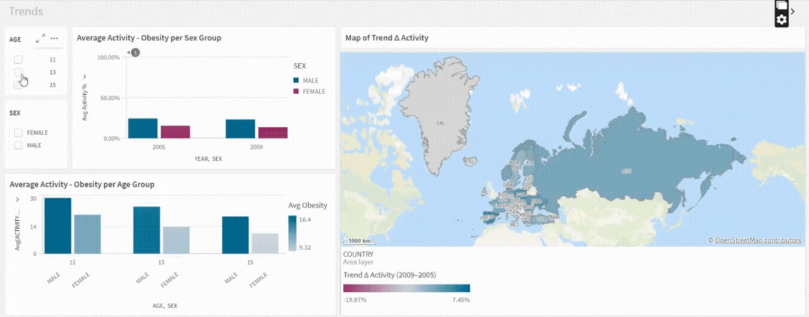
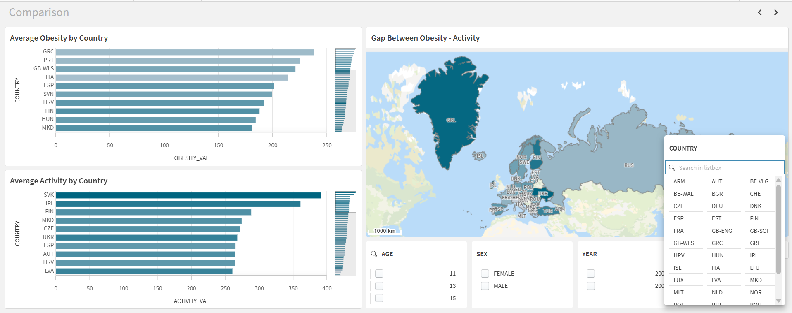
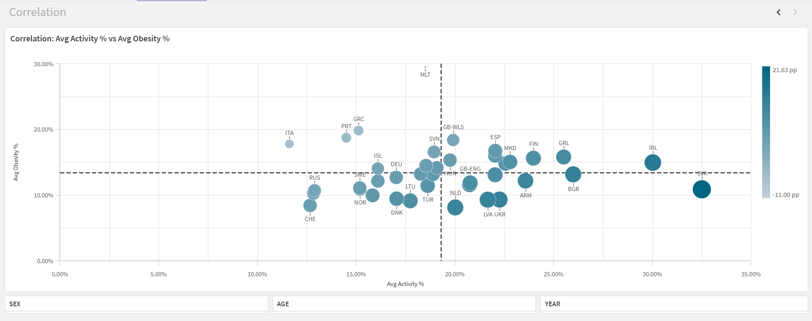

# Childhood Obesity & Physical Activity (WHO) — BI Pipeline

**Goal:** Build a small, reproducible BI pipeline about childhood obesity and physical activity using a curated dataset and a clear semantic layer.

## Quickstart
1. Use the frozen snapshot in this repo: `data/curated/df_merged.csv`.
2. In **Qlik Cloud** → Add data → **DataFiles** → upload `df_merged.csv`.
3. Build 3 sheets (Trends, Comparison, Correlation) with filters (AGE, YEAR, SEX, COUNTRY).

> This path requires **no** Azure access or secrets.

## Optional: Rebuild snapshot from ADLS
(ADLS Gen2 → Python ETL → Curated CSV/Parquet → Qlik)

# PowerShell
```powershell
$env:ADLS_SAS="?sv=..."
python .\scripts\transform_merge.py `
  --account childactivityobesity `
  --container activity-obesity-data `
  --write-parquet
```
# Bash
```bash
export ADLS_SAS='?sv=...'
python scripts/transform_merge.py \
  --account childactivityobesity \
  --container activity-obesity-data \
  --write-parquet
```

## Qlik Analysis — What the app shows

### Purpose
Give a clean, apples-to-apples view of **child physical activity** vs **overweight (incl. obesity)** across **country / age / sex / year**, and make it easy to spot trends, compare regions, and see the relationship between the two metrics.

### Data & grain
- **Grain:** 1 row = `COUNTRY × AGE × SEX × YEAR`
- **Years:** 2005, 2009 (activity + obesity aligned via inner join)
- **Measures:** `ACTIVITY_VAL` (% active), `OBESITY_VAL` (% overweight incl. obesity)
- **Gap (pp):** `ACTIVITY_VAL − OBESITY_VAL` (percentage points)

> Full KPI definitions live in **docs/SEMANTIC_LAYER.md**.

---

## Sheets

### 1) Trends
**Answers:** How did activity and obesity change between **2005 → 2009** for a given cohort?



**How to read/use**
- Set **AGE** and **SEX** in the filter bar.
- Optionally pick one or a few **COUNTRY** codes to compare.
- Two lines: **Avg Activity %** and **Avg Obesity %** over **YEAR**.

**What to look for**
- Direction of the lines (up/down).
- Whether the **gap** narrows or widens over time.
- Cohorts where activity rose while obesity fell (or vice-versa).

---

### 2) Comparison (bar)
**Answers:** Which countries have the **largest positive/negative gap** (Activity − Obesity) for the selected cohort?



**How to read/use**
- Fix **AGE**, **SEX**, and **YEAR**, then sort bars by the **Gap (pp)** measure (descending).
- Positive bars → activity outpaces obesity; negative bars → obesity higher than activity.

**What to look for**
- Top/bottom performers.
- Regional clustering (e.g., similar codes grouped together).
- Stability across AGE/SEX when you flip filters.

---

### 3) Correlation (scatter)
**Answers:** How strongly is **Activity %** related to **Obesity %**?



**How to read/use**
- X-axis: **Avg Activity %**; Y-axis: **Avg Obesity %**.
- Use **AGE**/**SEX** filters to isolate cohorts.
- (Optional) Color by AGE or SEX for quick grouping.

**What to look for**
- Overall slope (typically inverse relationship).
- Outliers: countries far from the main cluster.
- Whether the relationship changes by AGE or SEX.

---

## How to interact
- Use filters: **AGE, YEAR, SEX, COUNTRY**.  
- Measures are already *percent values*; visuals display averages for the current selection (no population weighting).

## Validation & scope notes
- Keys are non-null and unique; values are within **[0, 100]**.
- Sanity counts: processed (activity **438**, obesity **566**), curated inner join **438**.
