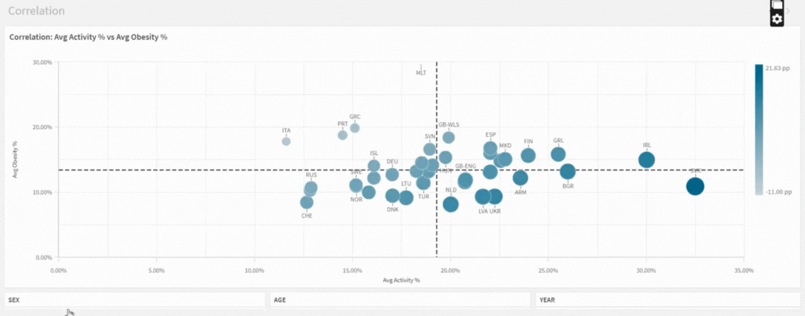

# Childhood Obesity & Physical Activity (WHO) — BI Pipeline

**Goal:** Build a small, reproducible BI pipeline about childhood obesity and physical activity using a curated dataset and a clear semantic layer.

## Quickstart (no cloud / no secrets)
1. Use the frozen snapshot in this repo: `data/curated/df_merged.csv`.
2. In **Qlik Cloud** → Add data → **DataFiles** → upload `df_merged.csv`.
3. Build 3 sheets (Trends, Comparison, Correlation) with filters (AGE, YEAR, SEX, COUNTRY).

> This path requires **no** Azure access or secrets.

## Optional: Rebuild snapshot from ADLS
(ADLS Gen2 → Python ETL → Curated CSV/Parquet → Qlik)

# PowerShell
```powershell
$env:ADLS_SAS="?sv=..."
python .\scripts\transform_merge.py `
  --account childactivityobesity `
  --container activity-obesity-data `
  --write-parquet
```
# Bash
```bash
export ADLS_SAS='?sv=...'
python scripts/transform_merge.py \
  --account childactivityobesity \
  --container activity-obesity-data \
  --write-parquet
```

## Qlik Analytics

**Trends**  


**Comparison**  


**Correlation**  

